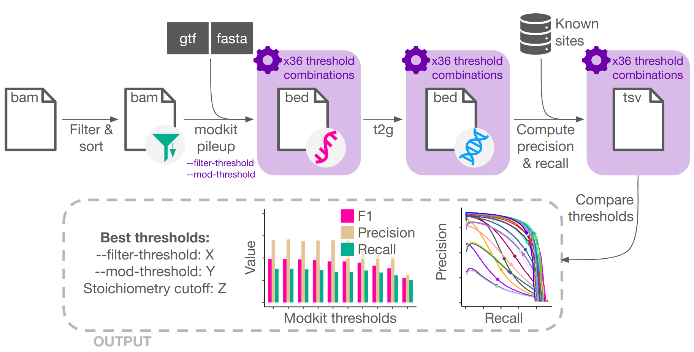

# ModkitOpt

ModkitOpt finds the best `--mod-threshold` and `--filter-threshold` parameters to use when running `modkit pileup`, and the best stoichiometry cutoff for filtering modkit's bedMethyl output, to maximise the sensitivity and recall of your nanopore direct RNA modification calls.

### Why use ModkitOpt?

By default, modkit estimates `--mod-threshold` and `--filter-threshold` by considering the confidence of dorado per-read modification predictions, without any knowledge of whether prediction confidence correlates with prediction accuracy. This means that datasets dominated by low-confidence calls, such as those for rare modifications like pseudouridine, will be assigned an insufficiently stringent threshold, resulting in elevated false discovery rates. We show in our paper (referenced below) that modification-calling accuracy is highly sensitive to threshold choice and that the default thresholds selected by modkit are often suboptimal. There is no quantitative framework to select thresholds that optimise the precision-sensitivity trade-off. 

### How ModkitOpt works

ModkitOpt takes as input a modBAM file containing dorado per-read modification calls, efficiently and systematically scans a comprehensive range of candidate modkit thresholds (`--filter-threshold` and `--mod-threshold`), and evaluates the resulting modkit calls against a reference set of known modification sites to quantify precision and recall. ModkitOpt identifies the optimal threshold combination, and corresponding stoichiometry cutoff, that optimise the precision-recall trade-off.

Reference sets of known modification sites are supplied for mammalian N6-methyladenosine (m6A) and pseudouridine (pseU), which we show can be used for mammalian nanopore datasets from any biological context. For other modification types, a reference set needs to be supplied by the user.

<p align="center">
  
</p>

### Citation

If you use this software, please cite:

> Ref TBD

# Quick start

To run locally using the example modBAM file we provide in `modkitopt/resources`, simply:

**1. Clone the repository**

```
git clone https://github.com/comprna/modkitopt.git
```

**2. Install dependencies**

* **modkit** >= v0.6.0

  * Download modkit_vXYZ.tar.gz from the [modkit release page](https://github.com/nanoporetech/modkit/releases)
  * Extract the archive contents
    ```
    tar -xvzf modkit_vXYZ.tar.gz
    ```
* **conda** ([Miniconda installation guide](https://www.anaconda.com/docs/getting-started/miniconda/install))
* **nextflow** ([installation guide](https://www.nextflow.io/docs/latest/install.html))

Nextflow will automatically install all other dependencies using conda (environment defined in `modkitopt/env.yaml`) the first time that modkitopt is run.

**3. Run ModkitOpt**

Run ModkitOpt on an example modBAM file containing m6A calls aligned to the human reference transcriptome (GRCh38.p14, release 45). To run this example, you need to use the same GENCODE human reference transcriptome and corresponding annotation ([GRCh38.p14, release 45](https://www.gencodegenes.org/human/release_45.html)) that was used to create the modBAM file.

**Important note:** This example demonstrates how the Nextflow pipeline operates, but the modBAM file is too small for ModkitOpt to provide a meaningful output.

```bash
cd /path/to/modkitopt

nextflow run main.nf                                          \
  --modbam           ./resources/example.bam                  \
  --mod_type         m6A                                      \
  --modkit           /path/to/modkit                          \
  --fasta            /path/to/gencode.v45.transcripts.fa      \
  --annotation       /path/to/gencode.v45.annotation.gff3     \
  -profile local
```

*Note:* The first time that you run ModkitOpt, Nextflow will create a conda environment and install dependencies - be patient, this will take a few minutes.

# Running in HPC environments

**We recommend running ModkitOpt in an HPC environment**, since modkit is called several times with different thresholds. Nextflow handles submitting modkit jobs so that they can run at the same time, reducing the overall execution time of ModkitOpt.

## Dependencies

The **modkit** binary that you downloaded and extracted in [Quick start](#quick-start) can simply be copied to your HPC storage location.

**Nextflow** and **conda** are often already provided in HPC environments as modules that can simply be loaded. If not, they need to be installed following the guidelines for your system.

## Running ModkitOpt

### The first time you run ModkitOpt in an HPC environment

Before running ModkitOpt inside a job, first run it on a login node (or a node where internet is available) so that Nextflow can create the conda environment. Once the conda environment is created and the Nextflow pipeline starts executing, you can kill the pipeline and then proceed with submitting your ModkitOpt job.

### Specifying your HPC environment details

When running in an HPC environment, you need to specify these things:

**1. Your HPC environment profile**

This tells Nextflow what type of workload manager it is dealing with. We currently support PBS, PBS Pro and Slurm systems. Specify this with the `-profile` flag, such as `-profile pbs`, `-profile pbspro` or `-profile slurm`. For NCI's gadi use `-profile pbspro`. Nextflow automatically handles creating and submitting jobs in each of these environments.

*Note:* We have only tested ModkitOpt in a `pbspro` environment (NCI's [gadi](https://nci.org.au/our-systems/hpc-systems)). Your specific HPC system may use different Nextflow directives, these can be updated in `modkitopt/profiles/pbspro.config`. While we have written profiles for `pbs` and `slurm`, these have not been tested. We welcome contributions from the community to improve these profiles, which can be found in `modkitopt/profiles/`. 

**2. Your HPC queue name**

You must specify the queue that Nextflow can schedule jobs to using the `--hpc_queue` flag, such as `--hpc_queue normal`. Since Nextflow only requires CPUs to execute, and up to 30GB memory for some of the tasks, the standard queue should suffice.

**3. Your HPC project code**

You must specify the HPC project code that Nextflow can schedule jobs to using the `--hpc_project` flag, such as `--hpc_project ab12`.

**4. Your HPC storage location**

You must specify your HPC storage location using the `--hpc_storage` flag. This should list all storage locations for your input files, conda environment, and the modkit repo, 
 such as `--hpc_storage gdata/ab12+gdata/cd34+scratch/ab12`.

### Command example

Briefly, the required input files are:
1. modBAM file output by dorado
2. FASTA and GTF/GFF3 annotation for modkit to use (the same FASTA as you provided to dorado, with corresponding GTF/GFF3 annotation).
3. TSV file containing ground truth sites (optional if your nanopore dataset is mammalian and your modification type is m6A or pseU)

See [Command details](#command-details) for more information.

```bash
nextflow run main.nf                                           \
  --modbam          /path/to/modbam.bam                        \
  --mod_type        m6A                                        \
  --modkit          /path/to/modkit                            \
  --fasta           /path/to/ref.fa                            \
  --annotation      /path/to/annotation.gff3                   \
  -profile          pbspro                                     \
  --hpc_queue       normal                                     \
  --hpc_project     ab12                                       \
  --hpc_storage     gdata/ab12
```

### Resuming an interrupted run

If your run gets interrupted, Nextflow automatically supports checkpointing and resuming runs. Simply add `-resume` to the Nextflow command that didn't complete and run again!

For example:

```bash
nextflow run main.nf                                           \
  --modbam          /path/to/modbam.bam                        \
  --mod_type        m6A                                        \
  --modkit          /path/to/modkit                            \
  --fasta           /path/to/ref.fa                            \
  --annotation      /path/to/annotation.gff3                   \
  -profile          pbspro                                     \
  --hpc_queue       normal                                     \
  --hpc_project     ab12                                       \
  --hpc_storage     gdata/ab12                                 \
  -resume
```

### Estimated run-time

We tested the execution time of ModkitOpt on an HPC system (NCI's [gadi](https://nci.org.au/our-systems/hpc-systems)) with a PBSPro scheduler and the default resource settings:

* 8 CPUs & 8GB RAM for samtools filter and samtools sort
* 8 CPUs & 30GB RAM for modkit pileup
* 4 CPUs & 8GB RAM for samtools index
* 1 CPU, 30GB RAM and 5GB job filesystem disk space for converting transcriptomic to genomic coordinates
* 1 CPU with 8GB RAM for all other tasks

| modBAM file size  | Mod type | Cell line | Execution time |
| ----------------- | -------- | --------- | -------------- |
| 7.4GB             | pseU     | HeLa      | 22 mins        |
| 10.8GB            | pseU     | HepG2     | 27 mins        |
| 12.4GB            | pseU     | K562      | 30 mins        |
| 13.1GB            | m6A      | HepG2     | 29 mins        |
| 13.8GB            | m6A      | K562      | 31 mins        |
| 21GB              | m6A      | HEK293T   | 33 mins        |

### Advanced use: Overriding the default Nextflow parameters

The default Nextflow parameters, contained in `nextflow.config` and `profiles/` can be overridden on the command-line.

For example, to increase the number of CPUs used for modkit pileup, you simply add `--pileup_cpus 16` to your Nextflow command.

# Command details

```
Usage:
The typical command structure for running the pipeline is as follows:
nextflow run main.nf --modbam sample.bam
                      --mod_type <m6A|pseU|m5C|inosine>
                      --modkit /path/to/modkit
                      --fasta /path/to/transcriptome.fa
                      --annotation /path/to/annotation.gff3
                      -profile <local|pbs|pbspro|slurm>

Mandatory arguments:
  --modbam             .bam file containing per-read modification calls
  --mod_type           Modification type (options: m6A, pseU, m5C, inosine)
  --modkit             Path to modkit executable
  --fasta              Path to reference transcriptome
  --annotation         Path to corresponding reference annotation (.gtf or .gff3)
  -profile             Execution environment (options: local, pbs, pbspro, slurm)

Mandatory arguments if running on an HPC system (-profile is pbs, pbspro or slurm):
  --hpc_queue          Name of the queue that Nextflow can schedule jobs to (e.g., 'normal')
  --hpc_project        HPC project code that Nextflow can schedule jobs to (e.g., 'ab12')
  --hpc_storage        HPC storage location that outputs can be written to (e.g., 'gdata/ab12')
  --help               This usage statement

Optional arguments:
  --truth_sites        .tsv file containing known modification sites (genomic 1-based coordinates, expected columns 1 and 2: [chr, pos], mandatory if mod_type is m5C or inosine)
```

# Tested environments and software versions

The following configurations have been tested:

| Execution environment | Modkit version |
| --------------------- | -------------- |
| pbspro (NCI's gadi)   | v0.6.0         |
| local                 | v0.6.0         |
