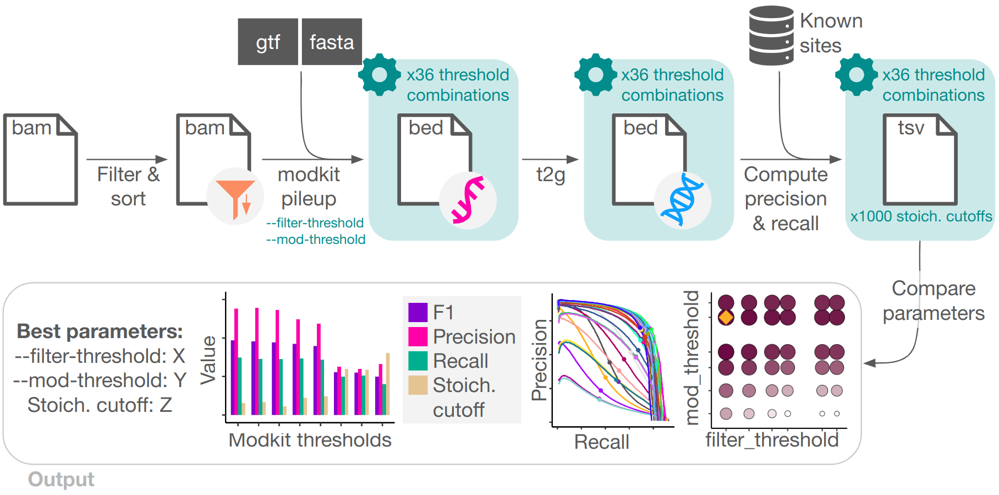
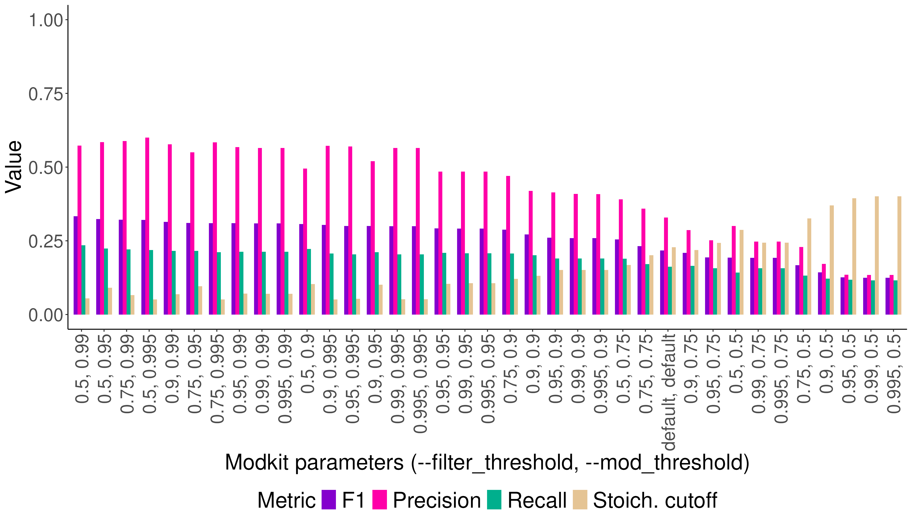
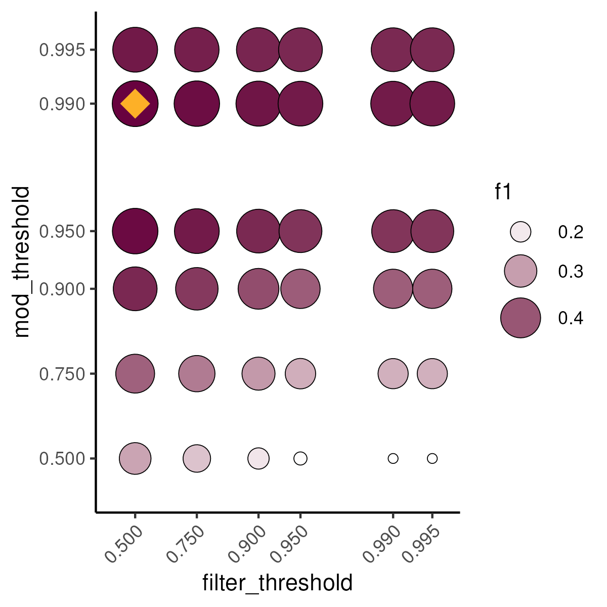
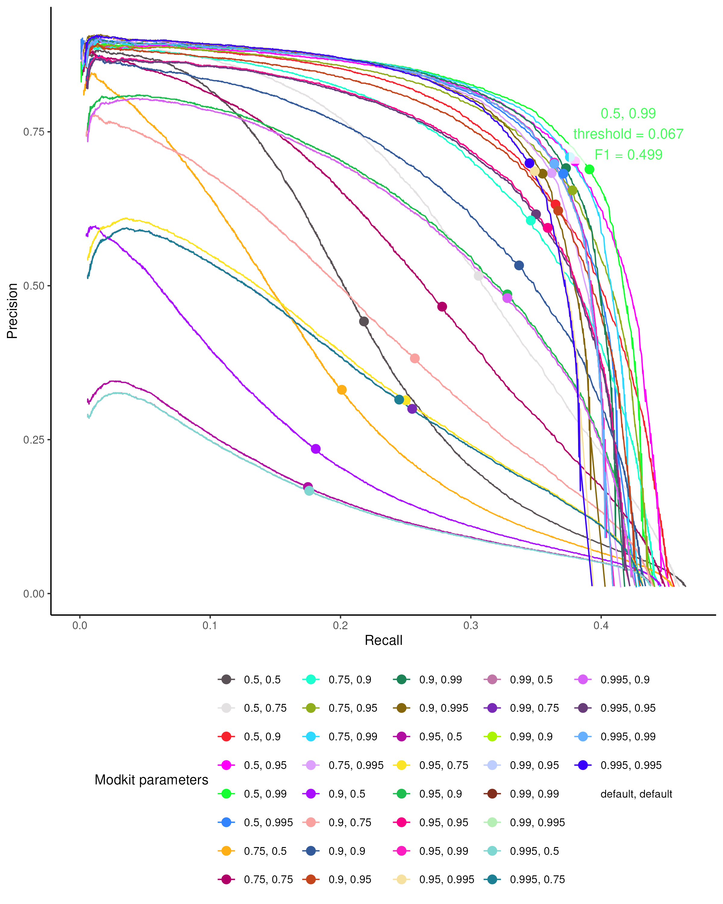

# ModkitOpt

ModkitOpt finds the best `--mod-threshold` and `--filter-threshold` parameters to use when running `modkit pileup`, and the best stoichiometry cutoff for filtering modkit's bedMethyl output, to maximise the precision and recall of nanopore direct RNA modification calls.

### Why use ModkitOpt?

By default, modkit uses a heuristic and unvalidated algorithm for quantifying RNA modifications, which can mislead reporting of RNA modification landscapes. ModkitOpt identifies optimised settings (`--mod-threshold`, `--filter-threshold` and stoichiometry cutoff) that rescue modkit performance, substantially increasing the acccuracy of RNA modification landscapes. Further details about modkit's default heuristic and ModkitOpt can be found in our paper, cited below.

### How ModkitOpt works

ModkitOpt takes as input a modBAM file containing dorado per-read modification calls, efficiently and systematically scans 36,000 combinations of modkit thresholds (`--filter-threshold` and `--mod-threshold`) and downstream stoichiometry cutoffs, and evaluates predicted sites against validated reference sites to quantify precision and recall. ModkitOpt identifies the optimal threshold combination, and corresponding stoichiometry cutoff, that maximises the F1 score ( $2 \cdot precision \cdot recall/(precision+recall)$ ).

Validated reference sites are supplied for mammalian N6-methyladenosine (m6A) and pseudouridine (pseU), which can be used for nanopore datasets that originate from a different biological sample, provided a subset of validated sites are shared. For other modification types, validated sites can be supplied by the user.

<p align="center">
  
</p>

# Citation

If you use this software, please cite:

> Sneddon, Prodic & Eyras. (2025). *Resolving systematic bias in nanopore-based RNA modification detection*. bioRxiv preprint. DOI: 10.64898/2025.12.19.695383

# Quick start

## Step 1: Clone the repository

```
git clone https://github.com/comprna/modkitopt.git
```

## Step 2: Install dependencies

### Download modkit

* **modkit** >= v0.6.0

  * Download modkit_vXYZ.tar.gz from the [modkit release page](https://github.com/nanoporetech/modkit/releases)
  * Extract the archive contents to your preferred location
    ```
    tar -xvzf modkit_vXYZ.tar.gz
    ```

### Install conda & nextflow

* **conda** ([Miniconda installation guide](https://www.anaconda.com/docs/getting-started/miniconda/install))
* **nextflow** ([installation guide](https://www.nextflow.io/docs/latest/install.html))

### Install conda environment

Note: Internet is required to install packages, so if running this in an HPC environment make sure you run on a node with internet access.

```bash
cd /path/to/modkitopt

nextflow run main.nf --install
```

## Step 3: Run ModkitOpt demo

The demo runs on a small example modBAM file and should complete in <5 mins.

```bash
cd /path/to/modkitopt

nextflow run main.nf --demo --modkit /path/to/modkit
```

## Step 4: Run ModkitOpt on your own dataset

### Command example

Briefly, the required input files are:
1. modBAM file output by dorado
2. FASTA and GTF/GFF3 annotation for modkit to use (the same FASTA as you provided to dorado, with corresponding GTF/GFF3 annotation).
3. TSV file containing ground truth sites (optional if your nanopore dataset is mammalian and your modification type is m6A or pseU)

See [Command details](#command-details) for more information.

See below for [how to specify your HPC environment details](#specifying-your-hpc-environment-details).

```bash
nextflow run main.nf                                           \
  --modbam          /path/to/modbam.bam                        \
  --mod_type        m6A                                        \
  --modkit          /path/to/modkit                            \
  --fasta           /path/to/ref.fa                            \
  --annotation      /path/to/annotation.gff3                   \
  -profile          pbspro                                     \
  --hpc_queue       normal                                     \
  --hpc_project     ab12                                       \
  --hpc_storage     gdata/ab12
```

### Recommended: Run in an HPC environment

Nextflow handles spawning jobs to split up the workflow, to significantly speed up execution time. If you don't have access to an HPC cluster, then you need to use a computer with at least 30GB RAM and at least 8 CPUs.

### Resources to request

Since Nextflow handles job creation and resource allocation for running the workflow, you only need to create one top-level job script containing the ModkitOpt command. The top-level job only requires 1 CPU and 4GB RAM.

### Tested HPC environments

We have so far tested ModkitOpt in a `pbspro` environment (NCI's [gadi](https://nci.org.au/our-systems/hpc-systems)). 

Your specific HPC system may use different Nextflow directives, these can be updated in `modkitopt/profiles/pbspro.config`.

While we have written profiles for `pbs` and `slurm`, these have not been tested. We welcome contributions from the community to improve these profiles, which can be found in `modkitopt/profiles/`.

**If you aren't familiar with your system's expected Nextflow directives, you can also [run ModkitOpt using `-profile local`](#nextflow-not-working-try-running-with-local-profile).**

### Specifying your HPC environment details

When running in an HPC environment, you need to specify:

**1. Your HPC environment profile**

This tells Nextflow what type of workload manager it is dealing with, allowing Nextflow to automatically handle creating and submitting jobs.

```bash
nextflow run main.nf                                           \
  ...
  -profile pbspro                                              \
  ...
```

**2. Your HPC queue name**

You must specify the queue that Nextflow can schedule jobs to. Since ModkitOpt only uses CPUs, and up to 30GB memory for some of the tasks, the standard queue should suffice. 

```bash
nextflow run main.nf                                           \
  ...
  --hpc_queue       normal                                     \
  ...
```

**3. Your HPC project code**

You must specify the HPC project code that Nextflow can schedule jobs to.

```bash
nextflow run main.nf                                           \
  ...
  --hpc_project     ab12                                       \
  ...
```

**4. Your HPC storage location**

You must specify your HPC storage location(s) that ModkitOpt will use. This includes all storage locations for your input files, conda environment, and the modkit repo.

```bash
nextflow run main.nf                                           \
  ...                                    
  --hpc_storage     gdata/ab12+gdata/cd34+scratch/ab12         \
  ...
```

### Nextflow not working? Try running with local profile

If you aren't familiar with your system's expected Nextflow directives, or Nextflow is having trouble creating jobs, you can also run ModkitOpt using `-profile local`.

Using the local profile means that Nextflow won't spawn jobs to run processes in parallel, so it may take a little longer to run but will produce the same results. Using this approach, your job needs at least 8 CPUs, at least 30GB of RAM and at least 5GB of job filesystem disk space.

```bash
cd /path/to/modkitopt

nextflow run main.nf                                          \
  --modbam           ./resources/example.bam                  \
  --mod_type         m6A                                      \
  --modkit           /path/to/modkit                          \
  --fasta            /path/to/gencode.v45.transcripts.fa      \
  --annotation       /path/to/gencode.v45.annotation.gff3     \
  -profile local
```

### Resuming an interrupted run

If your run gets interrupted, Nextflow automatically supports checkpointing and resuming runs. Simply add `-resume` to the Nextflow command that didn't complete and run again!

For example:

```bash
nextflow run main.nf                                           \
  --modbam          /path/to/modbam.bam                        \
  --mod_type        m6A                                        \
  --modkit          /path/to/modkit                            \
  --fasta           /path/to/ref.fa                            \
  --annotation      /path/to/annotation.gff3                   \
  -profile          pbspro                                     \
  --hpc_queue       normal                                     \
  --hpc_project     ab12                                       \
  --hpc_storage     gdata/ab12                                 \
  -resume
```

# Command details

```
Usage:
The typical command structure for running the pipeline is as follows:
nextflow run main.nf --modbam sample.bam
                      --mod_type <m6A|pseU|m5C|inosine>
                      --modkit /path/to/modkit
                      --fasta /path/to/transcriptome.fa
                      --annotation /path/to/annotation.gff3
                      -profile <local|pbs|pbspro|slurm>

Mandatory arguments:
  --modbam             .bam file containing per-read modification calls
  --mod_type           Modification type (options: m6A, pseU, m5C, inosine)
  --modkit             Path to modkit executable
  --fasta              Path to reference transcriptome
  --annotation         Path to corresponding reference annotation (.gtf or .gff3)
  -profile             Execution environment (options: local, pbs, pbspro, slurm)

Mandatory arguments if running on an HPC system (-profile is pbs, pbspro or slurm):
  --hpc_queue          Name of the queue that Nextflow can schedule jobs to (e.g., 'normal')
  --hpc_project        HPC project code that Nextflow can schedule jobs to (e.g., 'ab12')
  --hpc_storage        HPC storage location that outputs can be written to (e.g., 'gdata/ab12')
  --help               This usage statement

Optional arguments:
  --truth_sites        .tsv file containing validated modification sites (genomic 1-based coordinates, expected columns 1 and 2: [chr, pos], mandatory if mod_type is m5C or inosine)
```

# Output details

1. The optimal --filter_threshold, --mod_threshold and stoichiometry cutoff to use are written to standard out:

```bash
The optimal modkit pileup parameters are:

 >>> filter_threshold:  0.5
 >>> mod_threshold:     0.99

 With the optimal stoichiometry cutoff to classify modified sites:

 >>> Threshold: 0.086

 Achieving an F1 score of 0.008
```

2. A bar plot showing performance across the parameter space is written to `results/5_compare_params/barplot.png`

E.g.:

<p align="left">
  
</p>

See below for [Advanced outputs](#advanced-outputs)

# Estimated run-time

We tested the execution time of ModkitOpt on an HPC system (NCI's [gadi](https://nci.org.au/our-systems/hpc-systems)) with a PBSPro scheduler, with ModkitOpt's default resource settings:

* 8 CPUs & 8GB RAM for samtools filter and samtools sort
* 8 CPUs & 30GB RAM for modkit pileup
* 4 CPUs & 8GB RAM for samtools index
* 1 CPU, 30GB RAM and 5GB job filesystem disk space for converting transcriptomic to genomic coordinates
* 1 CPU with 8GB RAM for all other tasks

| modBAM file size  | Mod type | Cell line | Execution time |
| ----------------- | -------- | --------- | -------------- |
| 7.4GB             | pseU     | HeLa      | 22 mins        |
| 10.8GB            | pseU     | HepG2     | 27 mins        |
| 12.4GB            | pseU     | K562      | 30 mins        |
| 13.1GB            | m6A      | HepG2     | 29 mins        |
| 13.8GB            | m6A      | K562      | 31 mins        |
| 21GB              | m6A      | HEK293T   | 33 mins        |

# Tested environments and software versions

The following configurations have been tested:

| Nextflow profile | Modkit version | Nextflow version |
| --------------------- | -------------- | ---------------- |
| pbspro (NCI's gadi)   | v0.6.0         | 24.04.5          |
| local                 | v0.6.0         | 25.10.0          |

# Advanced use

## Overriding the default Nextflow parameters

The default Nextflow parameters are contained in `nextflow.config` and `profiles/`, and can be overridden on the command-line (or changed directly in nextflow.config).

Examples:

1. To increase the number of CPUs used for modkit pileup:

```bash
nextflow run main.nf                                           \
  ...                                    
  --pileup_cpus 16                                             \
  ...
```

2. To change the --filter-threshold and --mod-threshold values to test:

```bash
nextflow run main.nf                                           \
  ...                                    
  --mod_thresholds '[0.99, 0.995, 0.999]'                      \
  --filter_thresholds '[0.99, 0.995, 0.999]'                   \
  ...
```

## Advanced outputs

For users who would like more detailed outputs, ModkitOpt also provides:

1. A plot showing the F1 scores across the threshold space is written to `results/5_compare_params/ADVANCED_scatterplot.tsv`

E.g.:

<p align="left">
  
</p>

2. A plot showing the precision-recall curves for every tested threshold combination is written to `results/5_compare_params/ADVANCED_pr_curves.tsv`

E.g.:

<p align="left">
  
</p>

3. A tsv file with F1 score, precision and recall for each threshold combination (with the corresponding optimal stoichiometry cutoff per threshold combination) is written to `results/5_compare_params/ADVANCED_best_f1_scores.tsv`

E.g.:

| params | threshold | precision | recall | f1 |
| ------ | --------- | --------- | ------ | -- |
| f: 0.5, m: 0.99  |	0.078 |	0.651 |	0.352 |	0.45693320039880353 |
| f: 0.75, m: 0.99 |	0.085 |	0.66  |	0.344 |	0.4522709163346613  |
| f: 0.5, m: 0.95  |	0.102 |	0.628 |	0.35  |	0.4494887525562372  |
| f: 0.9, m: 0.99  |	0.09  |	0.658 |	0.339 |	0.4474663991975928  |
| f: 0.95, m: 0.99 |	0.092 |	0.652 |	0.337 |	0.4443356926188069  |
